# Current Function Map

## Assessment

The app has a coherent MVP function system. The strongest loop is:

`Profile -> calorie target -> Scan/Log/Activity -> Today dashboard -> Coach/Insights/Progress -> Profile adjustment`

This is enough for a private beta focused on calorie tracking, food scan, activity logging, body progress, and coaching. The main product functions are present and most of them share data through the same stores and backend APIs.

It is not yet a completely closed product loop in every area. Some features exist as backend/service/UI pieces but still feel loosely connected, especially subscription upsell, reminder feedback, roadmap visibility, and native health sync.

## Current Function Diagram

```mermaid
flowchart TD
  Start([Open App]) --> AuthGate{Has valid token?}
  AuthGate -- No --> Login[Login]
  AuthGate -- No --> Register[Register]
  Login --> AuthAPI[/auth/login/]
  Register --> AuthAPI2[/auth/register/]
  AuthAPI --> Tabs[Main App]
  AuthAPI2 --> Tabs
  AuthGate -- Yes --> ProfileAPI[/user/profile/]
  ProfileAPI --> Tabs

  Tabs --> Today[Today Dashboard]
  Tabs --> Scan[Scan Food]
  Tabs --> Log[Daily Log]
  Tabs --> Coach[AI Coach]
  Tabs --> Profile[Profile]

  Today --> DailyLog[/log/daily/]
  Today --> ActivityLog[/log/activity/]
  Today --> ActivityPrefs[/activity-preferences/]
  Today --> Gamification[/gamification/summary/]
  Today --> ProfileMeta[/user/profile/]
  Today --> QuickScan[Quick action: Scan]
  Today --> QuickLog[Quick action: Log]
  Today --> MovementPlan[Movement recommendation]
  Today --> SecondaryLinks[Progress / Insights / Achievements]

  QuickScan --> Scan
  QuickLog --> Log
  MovementPlan --> AddActivity[/log/activity/]
  AddActivity --> ActivityLog
  AddActivity --> DailyLog
  AddActivity --> Gamification

  Scan --> ImageScan[Camera / Gallery]
  Scan --> TextScan[Text]
  Scan --> VoiceScan[Voice transcript]
  Scan --> ReceiptScan[Receipt]
  Scan --> BarcodeScan[Barcode]
  Scan --> FoodSearch[Food search]
  ImageScan --> AIScanImage[/ai/scan/image/]
  TextScan --> AIScanText[/ai/scan/text/]
  VoiceScan --> AIScanVoice[/ai/scan/voice/]
  ReceiptScan --> AIScanReceipt[/ai/scan/receipt/]
  BarcodeScan --> FoodBarcode[/food/barcode/:barcode/]
  FoodSearch --> FoodSearchAPI[/food/search/]
  AIScanImage --> ScanResult[Editable scan result]
  AIScanText --> ScanResult
  AIScanVoice --> ScanResult
  AIScanReceipt --> ScanResult
  ScanResult --> RefineScan[/ai/scan/refine/]
  ScanResult --> SaveFoodLog[/log/]
  ScanResult --> SaveMeal[/log/saved-meals/]
  FoodBarcode --> SaveFoodLog
  FoodSearchAPI --> SaveFoodLog
  SaveFoodLog --> DailyLog
  SaveFoodLog --> Today
  SaveFoodLog --> Coach
  SaveMeal --> Log

  Log --> DailyLog
  Log --> SavedMeals[/log/saved-meals/]
  Log --> ActivityLog
  Log --> EditFood[/log/:id PATCH/]
  Log --> DeleteFood[/log/:id DELETE/]
  Log --> RestoreFood[/log/:id/restore/]
  Log --> LogSavedMeal[/log/saved-meals/:id/log/]
  Log --> ManualActivity[/log/activity/]
  Log --> Strength[Strength session]
  Log --> PreferenceActivity[Complete activity preference]
  Strength --> ManualActivity
  PreferenceActivity --> ManualActivity
  EditFood --> DailyLog
  DeleteFood --> DailyLog
  RestoreFood --> DailyLog
  LogSavedMeal --> DailyLog
  ManualActivity --> ActivityLog
  ManualActivity --> Today

  Coach --> CoachInsights[/coaching/insights/]
  Coach --> WeeklySummary[/coaching/weekly-summary/]
  Coach --> DailyLog
  Coach --> AskCoach[/ai/coach/]
  AskCoach --> FeatureGateAI{ai_coach enabled?}
  FeatureGateAI --> SubscriptionFeatures[/subscriptions/features/]
  FeatureGateAI -- Yes --> CoachReply[Coach reply]
  FeatureGateAI -- No --> PremiumError[Premium access message]
  CoachInsights --> AcknowledgeInsight[/coaching/insights/:id/acknowledge/]

  Profile --> ProfileAPI
  Profile --> SaveProfile[/user/profile PATCH/]
  Profile --> Reminders[/reminders/preferences/]
  Profile --> Subscription[/subscriptions/current + features/]
  Profile --> ActivityPrefs
  Profile --> GoalPlan[Goal plan]
  Profile --> HealthFlags[Health flags]
  SaveProfile --> CalorieTarget[/calorie-target/me/]
  SaveProfile --> DailyLog
  SaveProfile --> Insights
  SaveProfile --> Today
  GoalPlan --> CalorieTarget
  ActivityPrefs --> Today
  ActivityPrefs --> Log
  Reminders --> PushToken[/reminders/push-token/]
  Subscription --> FeatureGateAI
  Subscription --> HealthSyncGate{healthkit_sync enabled?}

  SecondaryLinks --> Progress[Progress]
  SecondaryLinks --> Insights[Insights]
  SecondaryLinks --> Achievements[Achievements]

  Progress --> BodyProgressList[/body-progress/]
  Progress --> BodyProgressTrend[/body-progress/trend/]
  Progress --> AddBodyProgress[/body-progress POST/]
  Progress --> DeleteBodyProgress[/body-progress/:id DELETE/]
  Progress --> AdjustmentPreview[/calorie-target/weekly-adjustment/preview/]
  Progress --> ApplyAdjustment[/calorie-target/weekly-adjustment/]
  AddBodyProgress --> BodyProgressTrend
  ApplyAdjustment --> CalorieTarget
  ApplyAdjustment --> Today

  Insights --> WeeklyInsights[/insights/weekly/]
  Insights --> WeeklyRecommendations[/calorie-target/recommendations/me/]
  WeeklyInsights --> Coach
  WeeklyRecommendations --> Today

  Achievements --> Gamification

  Profile --> HealthSync[Health Sync Diagnostics]
  HealthSync --> NativeHealth[Apple Health / Health Connect]
  NativeHealth --> HealthSyncGate
  HealthSyncGate -- Yes --> ActivitySync[/log/activity/sync/]
  ActivitySync --> ActivityLog
  ActivitySync --> Today
```

## Functions That Are Well Connected

- Auth gates the whole app and validates cached sessions through `/user/profile`.
- Profile drives target calculation, health guardrails, goal plan, reminders, subscription state, and activity preferences.
- Scan is well connected to Log: AI scan, barcode, search, refine, save as food log, and save as meal all feed `/log`.
- Log and Today are linked in both directions: logs update Today totals, Today can send users back to Scan/Log, and Today movement actions write activity logs.
- Activity preferences are shared by Profile, Today, and Log.
- Progress is connected to adaptive calorie target logic through body-progress data and weekly target preview/apply.
- Insights and Coach both consume food/activity history, with Coach also loading weekly summary and actionable insight cards.
- Gamification is connected to Today and Achievements.

## Loose Or Missing Links

- Paywall exists, and feature gating exists, but premium failures mostly become error messages. There is no strong automatic route from blocked AI Coach or Health Sync into the paywall/upgrade flow.
- Reminder preferences can be edited in Profile and push tokens are registered, but the user does not get a strong in-app reminder history or "did this nudge help me log?" feedback loop.
- Daily roadmap APIs and store methods exist, but the current product flow mostly uses activity preferences and movement recommendations. Roadmap is not yet a prominent user-facing planning surface.
- Coach reads context and can chat, but it does not appear to create concrete follow-up actions such as "log this meal", "add this activity", "save this goal tweak", or "schedule reminder" from a chat response.
- Health Sync is architected and connected to activity logs, but it is native-build dependent, so it is not part of the reliable Expo Go/web testing loop.
- Subscription management is available from Profile and Paywall, but payment/provider behavior still looks like a product shell or trial/manual tier switch rather than a complete purchase lifecycle.
- Telemetry/corrections exist, but the product UI does not yet expose a visible quality loop such as "your corrections improved future scans".

## Product Completeness Verdict

Functionally, the app is not missing a major core pillar for a calorie AI MVP. The core loop is present:

1. Set profile and target.
2. Capture food by scan/search/manual.
3. Track daily intake and activity.
4. See dashboard progress.
5. Get coach/insights/progress feedback.
6. Adjust plan from profile/progress.

The biggest remaining gap is not "more features"; it is making the existing features close loops more explicitly. The next best improvements are stronger upgrade routing, coach-to-action flows, reminder outcome tracking, and a clearer roadmap/planning surface.
